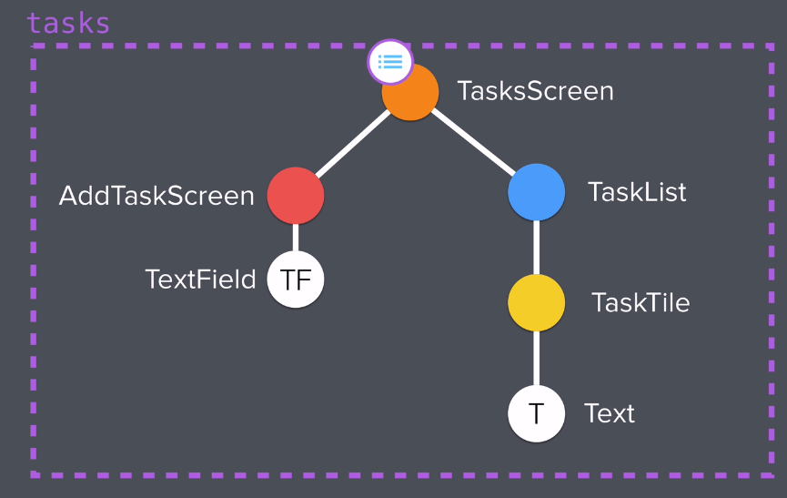

# todoey

# ListView
ListView is a scrollable widget that can hold multiple widgets. For example, the developer can add `ListTile`, `Text`, or `Icon` widgets.  

```dart
ListView(
      children: <Widget>[
        TaskTile(),
    ])
```

## ListTile
The ListTile is a convenient widget to organize the children of a ListView. It contains properties such as `title` and `trailing`.

```dart
ListTile(
      title: Text('This is a task'),
      trailing: Checkbox(
        value: false,
      ),
    );
```

# ListTile State
In order to create a Stateful widget that updates when the UI interface is changed, a Global State should be created. A Global State is different from a Local State because the value is used across an app. In my ListTile widget, both the state of the checkbox and string are updated with the use of a variable called `isChecked`.

```dart
TaskCheckbox(
  checkboxState: isChecked,
  toggleCheckboxState: (bool checkboxState) {
    setState(() {
      isChecked = checkboxState;
    });
  }),

``` 
`isChecked` variable is passed into TaskCheckbox as a new property, so it can be used to update the checkbox. 

## Lifting State



* Lift the State of tasks list to TasksScreen

  * Cut & Paste tasks list into TasksScreen
  * Convert TasksScreen into Stateful Widget
  * Pass tasks list into TaskList from TasksScreen
  * Create TaskList constructor that accepts task list as a property

* Edit AddTaskScreen
  
  * save newTaskTitle in onChanged of TextField
  * Create a AddTaskScreen callback inside of TasksScreen that prints newTaskTitle
  * Create AddTaskScreen constructor that accepts a callback as a property