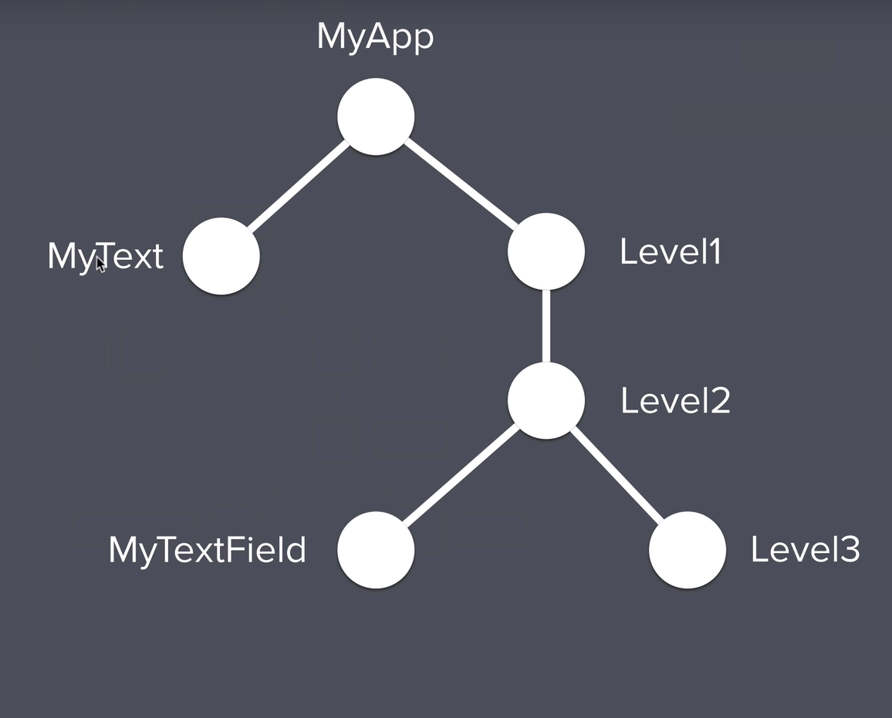

# todoey

# ListView
ListView is a scrollable widget that can hold multiple widgets. For example, the developer can add `ListTile`, `Text`, or `Icon` widgets.  

```dart
ListView(
      children: <Widget>[
        TaskTile(),
    ])
```

## ListTile
The ListTile is a convenient widget to organize the children of a ListView. It contains properties such as `title` and `trailing`.

```dart
ListTile(
      title: Text('This is a task'),
      trailing: Checkbox(
        value: false,
      ),
    );
```

# ListTile State
In order to create a Stateful widget that updates when the UI interface is changed, a Global State should be created. A Global State is different from a Local State because the value is used across an app. In my ListTile widget, both the state of the checkbox and string are updated with the use of a variable called `isChecked`.

```dart
TaskCheckbox(
  checkboxState: isChecked,
  toggleCheckboxState: (bool checkboxState) {
    setState(() {
      isChecked = checkboxState;
    });
  }),

``` 
`isChecked` variable is passed into TaskCheckbox as a new property, so it can be used to update the checkbox. 

## Lifting State


* Lift the State of tasks list to TasksScreen

  * Cut & Paste tasks list into TasksScreen
  * Convert TasksScreen into Stateful Widget
  * Pass tasks list into TaskList from TasksScreen

    `child: TasksList(tasks)`
  * Create TaskList constructor that accepts task list as a property

    ```dart 
    final List<Task> tasks;
    TasksList(this.tasks);
    ```

* Edit AddTaskScreen
  
  * save newTaskTitle in onChanged of TextField
  * Create a AddTaskScreen callback inside of TasksScreen that prints newTaskTitle
  * Create AddTaskScreen constructor that accepts a callback as a property

## Provider Widget

The Provider carries the state across multiple widgets. It is created from the [Inherited widget](https://api.flutter.dev/flutter/widgets/InheritedWidget-class.html) and acts as a wrapper around it. 

Here is a link to a basic project that focuses on the Provider widget: [Provider Github](https://github.com/caitlynbakery/basic_provider)



### Simple Scenario - No ChangeNotifier
* import the provider package from dart
* Create Provider widget around the top level widget.
In the example below, the Provider supplies the data variable to be used across the different widgets. 
* Angela's lesson shows Provider v3.0, but it has been updated to v4.0. In the newest version, builder method is replaced with the create and update methods. 

```dart
Widget build(BuildContext context) {
return Provider<String>(
  create: (context) => data,
  child: MaterialApp()
)}
```

* To access the data variable, use the following code. In the example, the Provider is returning the data so that it can be accessed within the Text widget. 

```dart
return Text(Provider.of<String>(context));
```

### Complex Scenario - ChangeNotifier

 This is more complex since it uses a method called ChangeNotifier that is prebuilt into Flutter. Angela used it to capture the updates from MyTextField into MyText. 

 The first step is to create a separate Data class that extends the ChangeNotifier class to update our data String. 

 ```dart
class Data extends ChangeNotifier{
  String data = 'Some data'
}
 ```

Next, we have to change the Provider class into a ChangeNotifierProvider that supplies a Data object. 

```dart
return ChangeNotifierProvider<Data>(
  builder: (context) => Data(),
)
```

We also have to alter the way the data is accessed from the Provider. Since the data is now in a separate Data class, you need to access the info from the .data property. 

```dart
return Text(Provider.of<Data>(context).data);
```

Create a changeString method within the Data class to update the string. The key part is the notifyListeners method which sends out a notification to rebuild the widgets that are listening to it. 

Finally, create a onChanged method inside MyTextField that accesses the changeString method from Provider class. The changeString method updates widgets with the notifyListeners method. The [listen: false](https://pub.dev/documentation/provider/latest/provider/Provider/of.html) is neccessary to implement the example below. `listen: false` is required for STATELESS widgets, while `listen: true` is used for STATEFUL widgets. 

```dart
TextField(
  onChanged: (newText){
    Provider.of<Data>(context, listen: false).changeString(newText);
  }
)
```

## Position of ChangeNotifierProvider

In my Todoey app, the ChangeNotifierProvider is placed in the `main.dart` file around the topmost widget. In this way, all the files under `main.dart` have access to the Data object. 

```dart
 return ChangeNotifierProvider(
      create: (context) => Data(),
      child: MaterialApp(
        home: TasksScreen(),
      ),
    );
```

## Consumer Widget

The Consumer widget belongs to the Provider class and simplifies the repetition of `Provider.of` method. Instead, it assigns `Provider.of` method to a variable to shorten the code.

```dart
return Consumer<Data>(
  builder: (context, taskData, child) {
    return ListView.builder(
      itemBuilder: (context, index){
        return TaskTile(
          taskTitle: taskData.tasks[index].name
    )})})
``` 

## Protecting data from programmer errors

It is important to restrict certain sections of your code to protect the data. For example, if a programmer tries to edit the data, it could potentially break the entire program and cause the data to crash. Once the data is protected with UnmodifiableListView, you have to use getter/setter methods to edit it.

### UnmodifiableListView

The UnmodifiableListView is an untouchable view of another list, so that the actual list is protected. You should use this when you want to keep the tasks list uneditable and safe.  

```dart
import 'dart:collection';
...

List<Task> _tasks = [
    Task(name: 'Buy Milk'),
    Task(name: 'Buy Cheese'),
    Task(name: 'Stan SKZ'),
  ];

  UnmodifiableListView<Task> get tasks {
    return UnmodifiableListView(_tasks);
  }
```

### Getter

In Dart, the `get` keyword refers to a getter function that retrieves specific data. For instance, I used the `get` for taskCount method to return the length of the data.

```dart
int get taskCount {
    return _tasks.length;
  }
```

### Setter

Similarly, the setter function sets certain class fields. Dart actually has built in getter/setter methods to a class, so you don't have to specifically use the `get` and `set` keywords. 

```dart
void addItem(String newTaskTitle) {
    final task = Task(name: newTaskTitle);
    _tasks.add(task);
    notifyListeners();
  }
```
